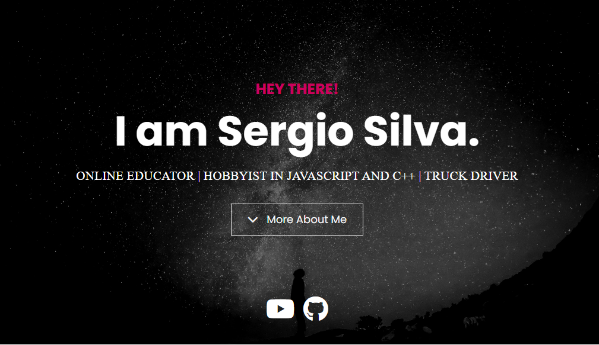

# Portfolio Website

This is a dark-light contrast website for a portfolio. It is related to being a web developer, but can be edited to be for any type of portfolio. It includes a bit of custom JavaScript for the typewriter effect and uses a script called "Lightbox" for the project modals.

## Features

- Dark and light contrast
- Responsive design
- Full height header/hero
- Background image overlays
- Typewriter effect in header
- Lightbox modals for projects
- Progress bar stats
- Font awesome icons
